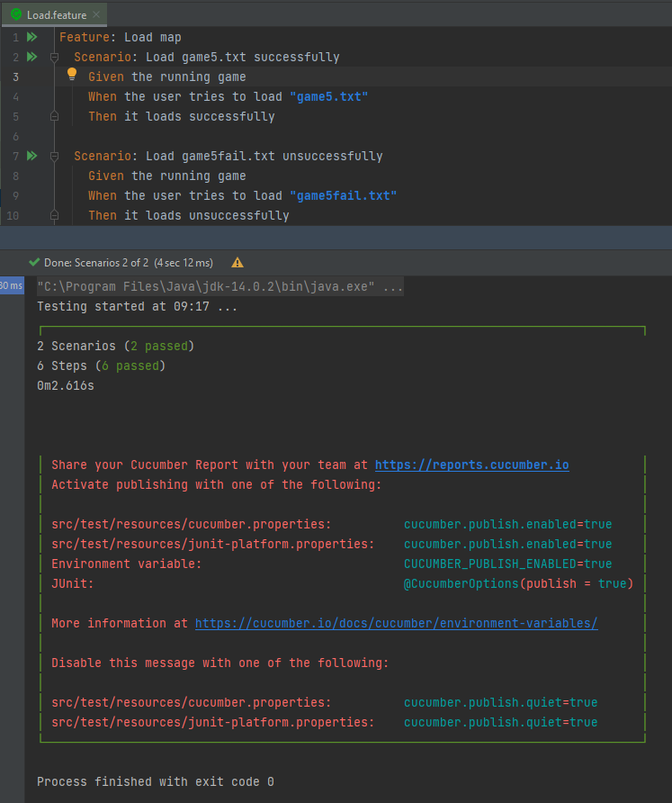
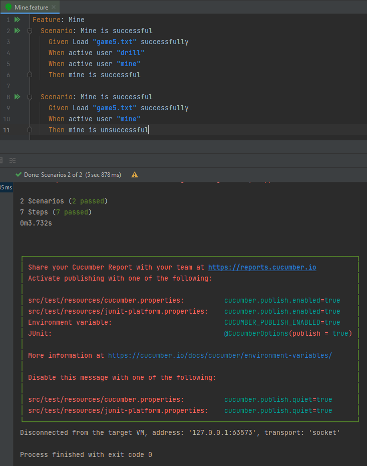
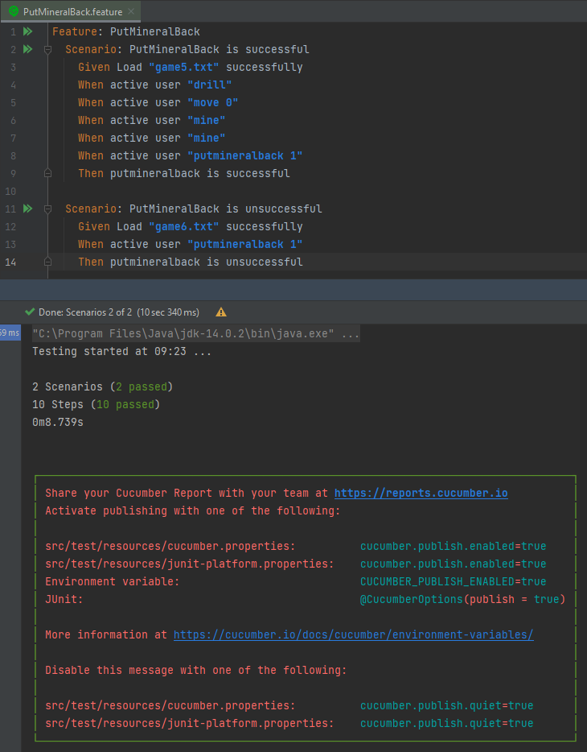

# 3. feladat: BDD testing with Cucumber

## 1. lépés: Cucumber behúzása a projektbe

Először Mavent hozzáadva próbálkoztunk. Valamiért ez nem akart működni, így rengeteg tutorial és stackowerflow böngészés után végül a Gradle használata mellett döntöttünk, ami kézenfekvő volt, hiszen a build keretrendszer is Gradleben készült el.

A tesztelés elvégzéséhez néhány apró változtatást kellett végezni a kódban:
- Tesztelés segítését segítő függvények felvétele pl. getter/setter a privát attribútumokra.
- Néhány új pálya felvétele a játékba (game5.txt és game6.txt)
- Packagek bevezetése, hogy a teszteléskor hivatkozhassunk a classokra

## 2. lépés: Tesztek elkészítése
### Pálya betöltésével kapcsoltos tesztek:

### Fúrással kapcsoltos tesztek:

### Bányászással kapcsoltos tesztek:

### Nyersanyag visszatevésével tesztek:

## 3. Eredmények: 
A tesztek elvégzése során kiderült egy a nyersanyag visszatevésével kapcsolatos hiba, a többi teszt nem fedett fel hibás működést.

## 4. Tanulságok:
Mikor nekikezdtem a feladat megoldásának nem igazán értettem sem a Maven, sem a Gradle működését, emiatt rengeteg időm ment el a Cucumber beimportálásával, ami elméletben egy nagyon egyszerű feladat, hiszen csak néhány sor kód. Miközben rengeteg fórumot végigjártam a megoldás keresésével, aközben észrevétlenül is sokat tanultam ezekről.