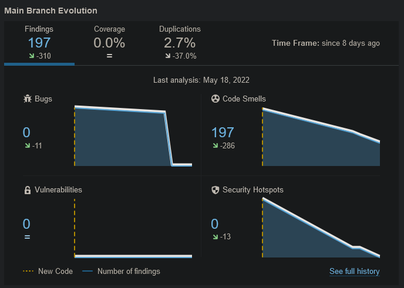

A SonarCloud setup-olás nem ment zökkenőmentesen. Eleinte a már korábban a main-re commit-olt fájlokat nem ellenőrizte, ennek oka egy rosszul formázott .yml fájl volt, amit sikeresen javítottunk. Ezután a beállítottuk a SonarCloud-ot. Nem minden beállítás volt változtatható, az Organization szintű beállításokhoz nem fértünk hozzá, így például nem tudtuk beállítani, hogy a teszt lefedettséget ne nézze a SonarCloud, nekünk ugyanis erre nem volt szükségünk, mert nem készítettünk Unit teszteket.

A fenti ábra mutatja a SonarCloud által jelzett bugokat, code smell-eket és biztonsági hibákat és hogy mennyire sikerült csökkentenünk ezek számát.

A bugok között volt súlyos probléma, Stringek == operátorral való összehasonlítása és a random objektumok nem újrahasználása. A code smell-eket végignéztük és több fajtáját javítottuk is. Voltak közöttük fontosabb feladatok, amik a kód minőségét javították, például az osztályok és metódusok statikusságának rendezése, egy helyen a shadowing fixálása és az osztályok architektúrának megfelelő package-ekbe szervezése.

Ezen felül eltávolítottuk a használaton kívüli importokat, a kikommentezett kódrészleteket és a gyakran használt string literálokat kiszerveztük konstansokba és az override függvények mind megkapták az @Override annotációt. Az üres metódusokban pedig kommentekkel jeleztük, hogy direkt maradtak üresen. Ezen felül néhány függvényt amelynek a komplexitását túl magasnak találtuk, szétszedtünk kisebb függvényekre.

Megvizsgáltuk a security hotspotokat is. Ezek nagyrésze nem volt releváns az esetünkben, hiszen a random objektumok (amelyek nem elég erős randomszám-generálást alkalmaznak erre a célre) nincsenek kriptográfiai célokra használva, hanem csak random események generálását végzik. Ami releváns volt az az exception esetén történő printStackTrace.

Sok olyan hibát is mutatott a SonarCloud, amit végül nem tekintettünk relevánsnak. Ezek között volt például, hogy ellenezte sun osztályok használatát, ami esetünkben nem a céget jelentette, hanem a projektben található, napot reprezentáló osztályt. 

Manuális kód átvizsgálás során találtunk több nehezen áttekinthető és kérdéses if használatot (értékadás if-en belül, csak else ág használáta), amiket javítottunk. Ezen felül specifikus exceptiont hoztunk létre és enhanced for-ra cseréltünk több sima for ciklust.
