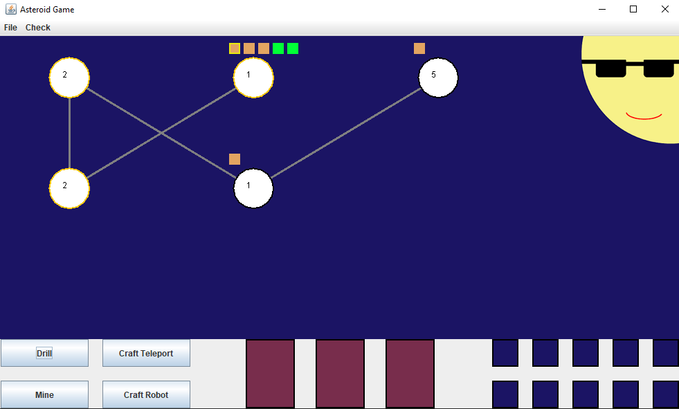
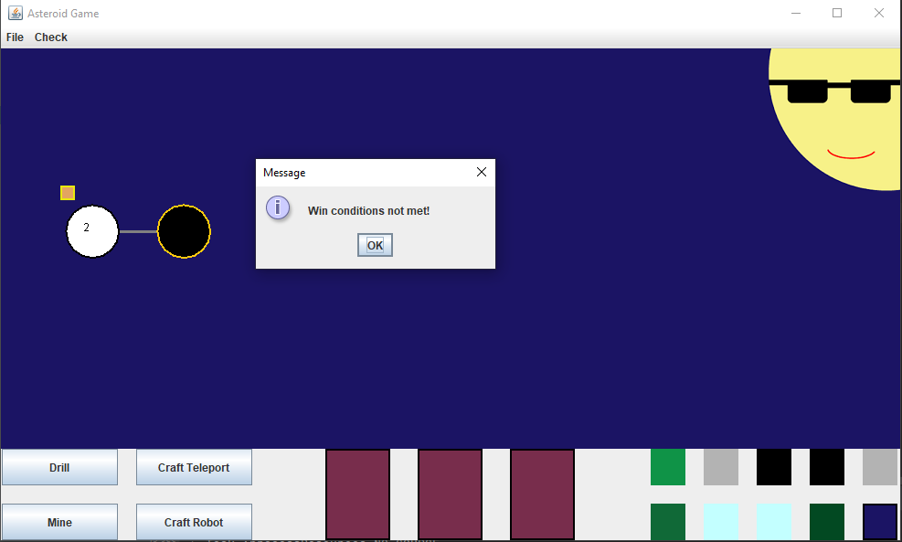
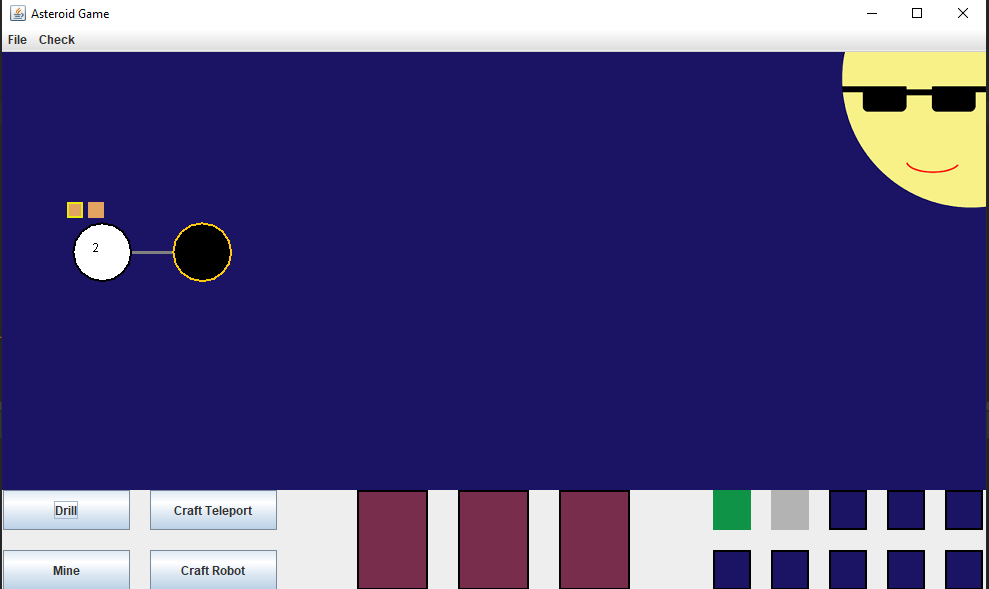
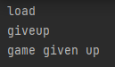
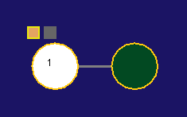
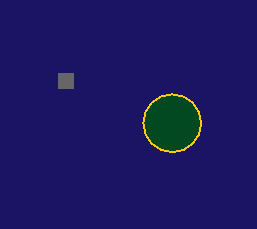
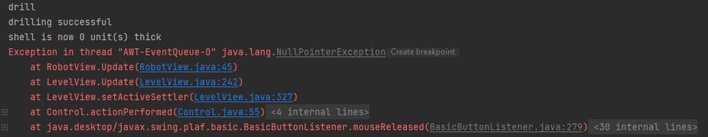
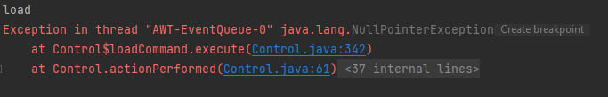

## Testing Notes
#1 Move to asteroid we can't
- load test1.txt
- click on unreachable asteroid

#2 Mine asteroid with layer
- load test1.txt
- mine

#3 Mine empty asteroid
- load test2.txt
- move to neighbour
- mine
- mine

#4 Settler explodes asteroid
- load test3.txt
- drill
- drill

#5 Robot explodes asteroid
- load test4.txt
- drill
- drill

#6 Game won 1 settler
- load test2.txt
- check win

#7 Game won 2 settlers
- load test5.txt
- check win

#8 Game not won 2 settlers
- load test6.txt
- check win

#9 Give up
- load test6.txt
- give up

#10 Put down teleport than travel
- load test7.txt
- craft teleport
- click teleport
- move to coal asteroid
- move to the layer 3 asteroid
- click teleport
- move to teleport

#11 Put back a uranium(2) while close to sun
- load test8.txt
- click uranium(2) (dark green)

#12 Put back mineral to not empty asteroid
- load test2.txt
- move to coal asteroid
- click on ice

#13 Create game from not savefile
- new game
- 5 settlers
- 13 asteroids
- 4 UFOs
- drill
- move
- drill
- move

#14 Load then cancel it
- load
- cancel

#15 Save and reload maps and check
- new game
- 5 settlers
- 5 asteroids
- 2 ufos
- save as test9.txt
- load test9.txt

## Output Data Files

**#15:**

Before save:

After load:

**#500:**

Check win output:

**#501:**

UI:

Console:

**#1000:**

Frozen: 

Window resize:

Exception:

**#1001:**

Console:

## Issues
> Starting from #500

**#500** One settler can't win the game
- #6 test
- might be because of the specification

**#501** No UI message for giving up
- #9 test
- console prints it
- user has no feedback

## Bugs
> Starting from #1000

**#1000** Nullpointer exception
- #5 test
- Robot's asteroid returns null
- UI freezes (must be because of the exception) 

**#1001** Nullpointer exception
- #14 test
- file is null ----> generates exception
